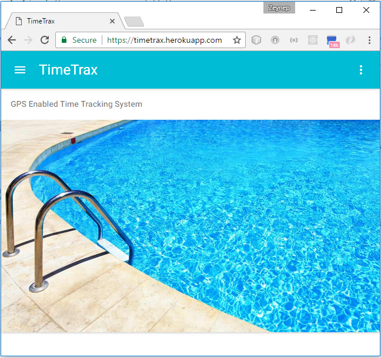
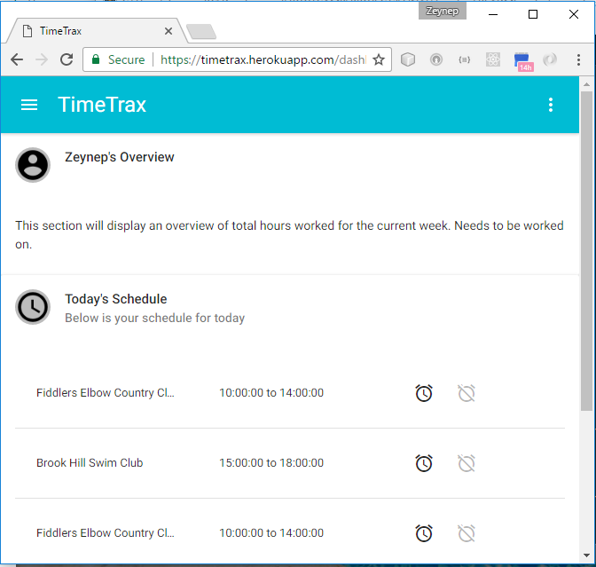

# timetrax
GPS based time tracker

### Technologies Used

  * NodeJS
  * NPM
  * Express
  * Webpack
  * Babel/ES6
  * React
  * Passport
  * Nodemon
  * Sequelize
  * Sequelize-CLI
  * MySQL
  * Material UI
  
### Getting Started In Development

npm install

webpack 

node server

Visit `localhost:3000` in your browser.

## Screenshots

Landing Page:

Dashboard:

